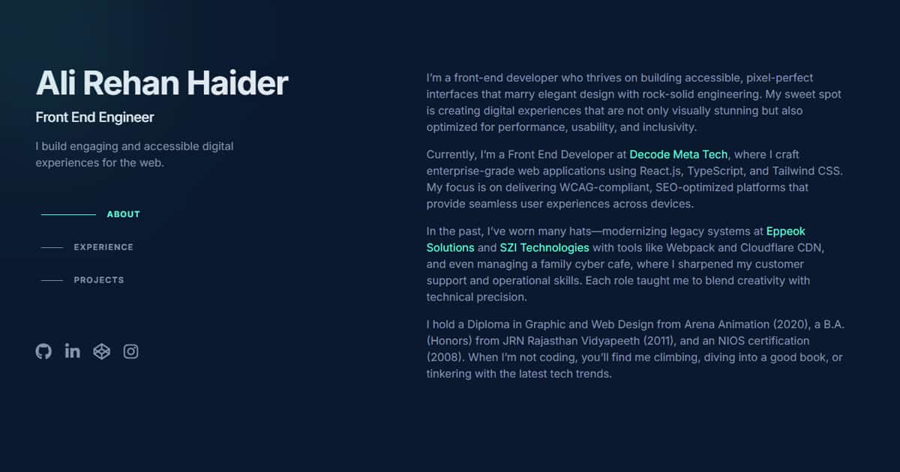

# Ali Rehan Haider - Personal Portfolio

This is the repository for the personal portfolio website of Ali Rehan Haider, a Front End Engineer. The website showcases his skills, experience, and projects.

**Live Site:** [Link to Live Site] <!-- Replace with actual URL -->

## Preview


<!-- Assuming preview-image.jpg is in public/assets. Adjust path if necessary. -->

## Tech Stack

The project is built with modern web technologies to ensure a responsive, fast, and interactive user experience:

*   **Framework:** [Next.js](https://nextjs.org/) (v15.1.7)
*   **UI Library:** [React](https://reactjs.org/) (v19)
*   **Language:** [TypeScript](https://www.typescriptlang.org/)
*   **Styling:** [Tailwind CSS](https://tailwindcss.com/)
*   **Animations:** [Framer Motion](https://www.framer.com/motion/)
*   **Linting:** [ESLint](https://eslint.org/)

## Features

*   **Responsive Design:** Adapts to various screen sizes, providing an optimal viewing experience on desktops, tablets, and mobile devices.
*   **Interactive UI:** Smooth animations and transitions using Framer Motion.
*   **Key Sections:**
    *   **About:** Information about Ali Rehan Haider, his background, and expertise.
    *   **Experience:** Detailed overview of his professional work history.
    *   **Projects:** Showcase of projects he has worked on, with links and descriptions.
*   **Custom Hooks:** Utilizes custom React hooks for functionalities like gradient cursor (`useGradientCursor`), sticky section headers (`useStickyHeaders`), and active section tracking (`useActiveSection`).
*   **Accessibility:** Designed with accessibility in mind, including WCAG considerations mentioned in project descriptions.
*   **SEO Optimized:** Built with practices to enhance search engine visibility.

## Getting Started

To run this project locally:

1.  **Clone the repository:**
    ```bash
    git clone https://github.com/your-username/ali-rehan-portfolio.git # Replace with actual repo URL if different
    cd ali-rehan-portfolio
    ```

2.  **Install dependencies:**
    ```bash
    npm install
    ```
    or if you prefer yarn:
    ```bash
    yarn install
    ```

3.  **Run the development server:**
    ```bash
    npm run dev
    ```
    or
    ```bash
    yarn dev
    ```
    Open [http://localhost:3000](http://localhost:3000) in your browser to see the result.

## Build

To create a production build:

```bash
npm run build
```
or
```bash
yarn build
```

## Deployment

This site is deployed on [Vercel](https://vercel.com/), leveraging its platform for optimal Next.js hosting.

## Code Structure

*   `src/app/`: Contains the main application pages (e.g., `page.tsx` for the homepage, `archive/page.tsx` for the project archive).
*   `src/components/`: Reusable UI components (e.g., `SocialIcons.tsx`).
*   `src/hooks/`: Custom React hooks for shared logic.
*   `public/`: Static assets like images, fonts, and resume files.
*   `package.json`: Lists project dependencies and scripts.
*   `next.config.ts`: Configuration for Next.js.
*   `tailwind.config.ts`: Configuration for Tailwind CSS.

## Design and Acknowledgements

*   Design inspired by modern portfolio trends, loosely designed in [Figma](https://www.figma.com/).
*   Coded in [Visual Studio Code](https://code.visualstudio.com/).
*   Typography uses the [Inter](https://rsms.me/inter/) typeface.

---

This README provides a comprehensive overview of the project.
